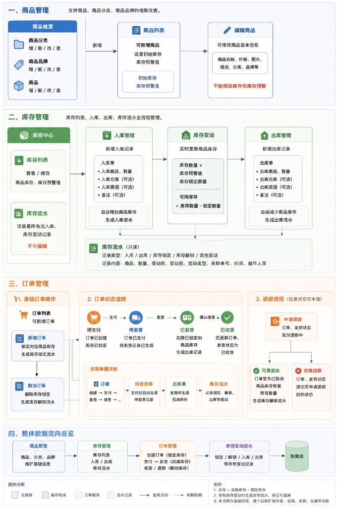

# 门店简易记账 · 后端（微服务学习仓）

> ⚠️ **本目录是微服务拆分学习副本（`store-inventory-backend-ms`）**  
> - 从单体标签 **v2.0.0** 检出，分支 `ms/dev`  
> - **不要**与家里在用的单体仓 `store-inventory-backend` 混用、误推  
> - 单体继续跑生产/家庭使用；本仓用**不同端口**做订单 + 库存拆分实验  

> 最初给自家门店用，帮母亲替代手工记账；单体已发布 **v2.0.0（AI 全接入）**。本仓在其基础上做微服务演进学习。

[](#)
[](https://openjdk.org/)
[](https://spring.io/projects/spring-boot)
[](https://www.postgresql.org/)
[](https://redis.io/)
[](https://baomidou.com/)
[](https://doc.xiaominfo.com/)
[](https://www.apache.org/licenses/LICENSE-2.0)

---

## 能做什么

- **门店开单**：选商品、记一笔，自动扣库存、算金额和利润
- **销售统计**：查看流水，汇总今日 / 本月营收
- **商品 & 库存**：品牌分类、入出库、库存预警
- **订单管理**：下单锁库存、发货扣库存、退款回滚
- **权限 & 日志**：登录鉴权、角色权限、操作记录
- **AI 辅助（v2）**：智能客服、商品智搜、补货建议、SQL/运维助手、看板洞察与预测

---

## 系统架构


详细说明：[docs/系统架构设计.md](docs/系统架构设计.md)

---

## 业务流转



详细说明：[docs/业务流转图.md](docs/业务流转图.md)

---

## RBAC 权限


详细说明：[docs/RBAC权限设计.md](docs/RBAC权限设计.md)

---

## 项目文档

| 文档 | 说明 |
|------|------|
| [系统架构设计](docs/系统架构设计.md) | 技术栈与分层 |
| [业务流转图](docs/业务流转图.md) | 商品 / 库存 / 订单流程 |
| [RBAC 权限设计](docs/RBAC权限设计.md) | 登录与权限 |
| [后端功能模块](docs/后端功能模块.md) | 模块能力一览 |
| [后端目录结构](docs/后端目录结构.md) | 代码包结构 |
| [API 接口设计](docs/API接口设计.md) | 接口约定与速查 |
| [数据库设计](docs/数据库设计.md) | 表结构与关系 |

---

## 快速启动

**环境：** JDK 17 · Maven 3.8+ · PostgreSQL · Redis

```bash
git clone <你的仓库地址>
cd store-inventory-backend
```

1. 创建数据库 `inventory_store`
2. 按顺序执行以下 SQL 脚本：

   | 顺序 | 文件 |
   |------|------|
   | 1 | [docs/sql/数据库建表语句.sql](docs/sql/数据库建表语句.sql) |
   | 2 | [docs/sql/权限插入.sql](docs/sql/权限插入.sql) |
   | 3 | [docs/sql/角色插入.sql](docs/sql/角色插入.sql) |
   | 4 | [docs/sql/用户.sql](docs/sql/用户.sql) |

   > 仅在全新空库执行，重复执行可能主键冲突。

3. 修改 `src/main/resources/application.yml`，将 `spring.profiles.active` 改为 `dev`
4. 修改 `application-dev.yml` 中的数据库、Redis 连接（密码建议用环境变量 `DB_PWD`、`REDIS_PWD`）
5. 启动：

```bash
mvn spring-boot:run
```

**接口文档：** http://localhost:8080/api/doc.html

---

## 后续规划

> 中长期演进方向，不含排期与版本号，按业务优先级与实际节奏逐步推进。详见 [CHANGELOG.md](CHANGELOG.md)。

- **核心业务高并发改造**：聚焦库存扣减、下单锁单等关键链路，完善分布式锁与幂等校验，防范超卖与重复提交
- **智能能力接入**：引入 AI 辅助能力（销售分析、经营摘要、智能问答等），与进销存、订单、门店收银深度打通
- **微服务架构演进**：由单体逐步拆分为领域微服务，建设 API 网关、认证中心与各业务服务
- **云原生体系建设**：容器化部署（Docker / Kubernetes）、CI/CD 流水线，以及日志、指标、链路追踪等可观测性能力
- **微信商城小程序**：面向 C 端的轻量微信商城，与商品、库存、订单体系联动，实现线上线下一体化

---

## 说明

自家门店自用项目，按实际需求迭代。欢迎 Star / Issue 交流。

**更新日志：** [CHANGELOG.md](CHANGELOG.md)

**许可证：** [Apache License 2.0](https://www.apache.org/licenses/LICENSE-2.0)
