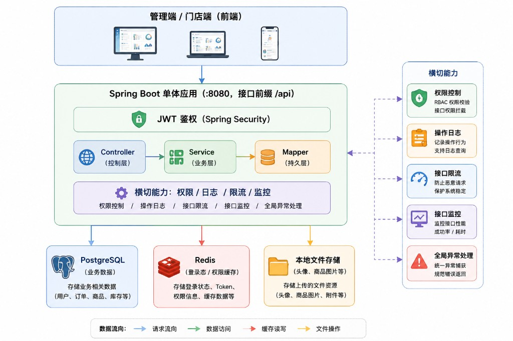
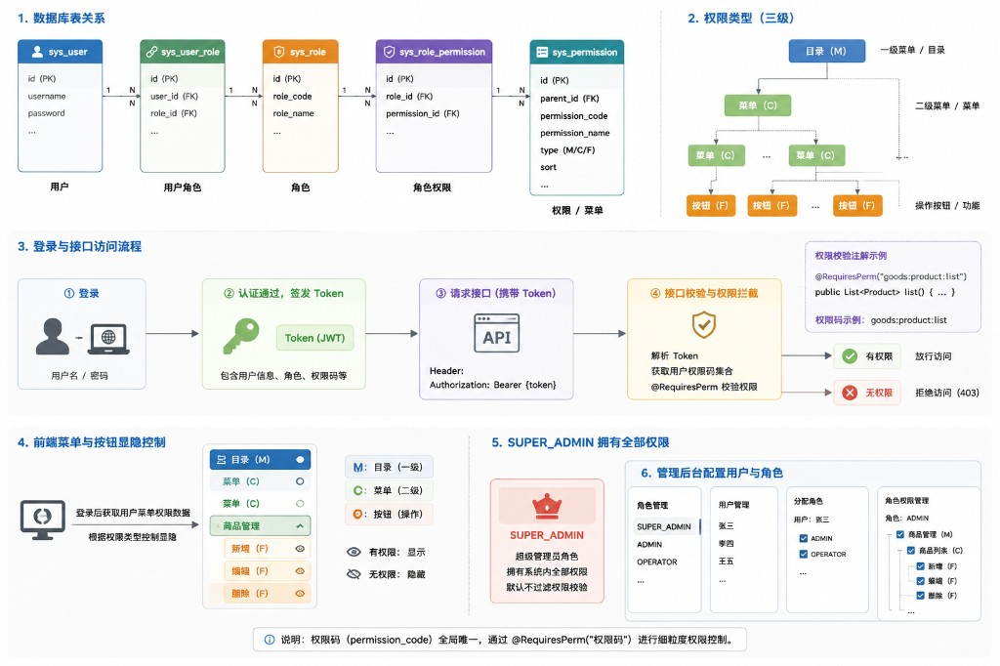

# 智联数贸平台 · 后端

> 门店 / 配件供应链管理系统 RESTful 后端服务  
> Spring Boot 3 分层架构 · JWT 双 Token · RBAC 权限 · 统一 API 规范

[](https://spring.io/projects/spring-boot)
[](https://www.oracle.com/java/)
[](https://www.postgresql.org/)
[](https://redis.io/)
[](LICENSE)

<!-- 项目封面图（建议尺寸 1200×400） -->


---

## 项目简介

**智联数贸平台后端**（`store-inventory-backend`）是面向门店与配件场景的**进销存 + 运营管理系统**，提供用户认证、RBAC 权限、商品库存、订单流转、门店收银、系统监控等核心能力。

- 接口前缀：`/api`
- 统一响应：`Result<T>` → `{ code, message, data }`
- 接口文档：Knife4j 在线调试

---

## 功能预览

<!-- 管理端首页看板截图 -->


<!-- Knife4j 接口文档截图 -->


---

## 技术栈

| 类别 | 技术 |
|------|------|
| 基础框架 | Spring Boot 3.2.5 |
| 开发语言 | JDK 17 |
| 安全认证 | Spring Security + JWT 双 Token |
| 缓存 | Redis 7+（Lettuce 连接池） |
| 数据库 | PostgreSQL 14+ |
| ORM | MyBatis-Plus 3.5.5 |
| 接口文档 | Knife4j（OpenAPI 3） |
| 工具库 | Lombok、Hutool、OSHI、ip2region |

---

## 核心亮点

### 业务亮点

- **商品全链路管理**：品牌、树形分类、商品信息维护，支持上下架与图片上传
- **库存实时管控**：库存列表、入库/出库单据、变动流水与预警阈值联动
- **入库出库自动联动**：创建入出库单后自动更新库存、写入流水并刷新预警状态
- **订单锁定防超卖**：下单时预占锁定库存，取消订单自动释放
- **订单全生命周期**：待支付 → 待发货 → 已发货 → 已收货，支持取消与退款
- **支付自动生成发货单**：确认支付后同步创建待发货记录，打通订单与发货
- **发货扣减真实库存**：确认发货时扣减可用库存并同步更新主订单状态
- **退款审核闭环**：通过退货入库恢复库存，拒绝时还原订单与发货单原状态
- **门店收银开单**：现场销售扣减门店库存，自动计算销售额与利润
- **门店营收统计**：支持今日/本月销售统计与门店看板概览
- **管理端数据看板**：今日销售额、订单数、库存总量、预警数及销售趋势聚合展示
- **RBAC 权限体系**：用户、角色、权限树、动态菜单与按钮级权限分配
- **在线用户管控**：查看活跃会话，支持强制下线与踢出其他设备
- **操作审计追溯**：登录日志与操作日志分页查询，支持 Excel 导出
- **个人中心**：账号概览、设备管理与个人日志自助查询导出

### 技术亮点

- **JWT 双 Token 认证**：AccessToken 接口鉴权 + RefreshToken 无感续期
- **Redis 登录态校验**：JWT 与 Redis 双重校验，支持多设备会话映射
- **权限 Redis 缓存**：用户权限码缓存，角色/权限变更后主动失效
- **自定义权限注解**：`@RequiresPerm` + AOP 实现接口级细粒度鉴权
- **超级管理员放行**：`SUPER_ADMIN` 角色自动绕过权限校验
- **接口限流防刷**：`@RateLimit` 基于 Redis 滑动窗口（注册等敏感接口）
- **操作日志自动采集**：`@OperationLog` AOP 记录增删改等关键操作
- **API 性能自动监控**：`ApiMonitorAspect` 采集接口耗时与成功率
- **全局统一异常处理**：业务/权限/参数异常统一返回 `Result` JSON
- **BCrypt 密码加密**：用户密码单向哈希存储，注册登录安全校验
- **逻辑删除**：MyBatis-Plus `@TableLogic` 软删除，数据可恢复
- **雪花算法主键**：分布式唯一 ID，适用于订单号/入库单号等业务单号
- **登录 IP 归属地**：集成 ip2region 解析登录地理位置
- **数据脱敏展示**：用户列表手机号等敏感字段自动脱敏
- **Excel 数据导出**：登录日志、操作日志、库存流水支持导出
- **Knife4j 接口文档**：OpenAPI 3 自动生成，在线调试全部接口

### 架构亮点

- **单体分层架构**：`common` / `config` / `framework` / `modules` 四层清晰解耦
- **领域模块化分包**：按 auth、goods、invertory、order、shop、system 等领域划分
- **标准三层调用链**：Controller → Service → Mapper，DTO/VO 分离传输对象
- **横切能力基础设施化**：鉴权、日志、限流、监控统一沉淀在 `framework` 层
- **Spring Security 无状态会话**：关闭 CSRF/Session，适配前后端分离 JWT 模式
- **JWT 过滤器链集成**：自定义 `JwtAuthenticationFilter` 接入 Security 认证链路
- **关键业务事务保障**：订单、库存、退款等核心流程 `@Transactional` 保证一致性
- **多环境 Profile 配置**：dev/prd 分离数据库、Redis、CORS、上传路径等配置
- **PostgreSQL + Redis 双存储**：关系型数据持久化 + 缓存会话/权限/限流
- **服务器运行监控**：基于 OSHI 采集 CPU、内存、磁盘、JVM 等指标
- **Redis 运维监控**：基础指标、大 Key 定时扫描（Top50）、趋势图数据
- **统一 API 响应规范**：`Result<T>` + `ResultCode` 枚举，前后端协作约定清晰
- **静态资源与跨域配置**：头像/商品/品牌图片本地存储，CORS 支持前端联调

> 完整亮点说明见 [docs/README亮点功能.md](docs/README亮点功能.md)

---

## 系统架构

<!-- 系统架构图（建议从 docs/系统架构设计.md 导出或手绘） -->


```
客户端（管理端 / 门店端）
        │
        ▼
Spring Boot 应用层（:8080/api）
  ├── Security + JWT 过滤器链
  ├── AOP（权限 / 日志 / 限流 / 监控）
  ├── Controller → Service → Mapper
  └── 统一异常 + Result 响应
        │
   ┌────┴────┐
   ▼         ▼
PostgreSQL  Redis + 本地文件存储
```

---

## 业务模块

| 领域 | 模块 | 路由前缀 | 状态 |
|------|------|----------|------|
| 认证 | 认证中心 | `/auth` | ✅ |
| 系统 | 用户 / 角色 / 权限 / 菜单 | `/sysUser` `/sysRole` `/sysPermission` `/system/menu` | ✅ |
| 系统 | 在线用户 / 日志 | `/sys/online` `/system/login/log` | ✅ |
| 商品 | 品牌 / 分类 / 商品 | `/goods/*` | ✅ |
| 库存 | 库存 / 入库 / 出库 / 预警 / 流水 | `/inventory/*` | ✅ |
| 订单 | 订单 / 发货 / 退款 | `/order/*` | ✅ |
| 门店 | 看板 / 商品 / 销售 | `/shop/*` | ✅ |
| 监控 | API / 服务 / Redis | `/monitor/*` | ✅ |
| 看板 | 管理端首页 | `/dashboard` | ✅ |
| 个人 | 个人中心 / 我的日志 | `/profile` | ✅ |

<!-- 订单状态流转图（建议从 docs/业务流转图.md 导出） -->


<!-- RBAC 权限模型图 -->


> 模块详情见 [docs/后端功能模块.md](docs/后端功能模块.md) · 业务流转见 [docs/业务流转图.md](docs/业务流转图.md)

---

## 目录结构

```
store-inventory-backend/
├── docs/                          # 项目文档
│   ├── images/                    # README 展示图片（需自行补充）
│   ├── 后端目录结构.md
│   ├── 后端功能模块.md
│   ├── API接口设计.md
│   ├── RBAC权限设计.md
│   ├── 数据库设计.md
│   ├── 业务流转图.md
│   ├── 系统架构设计.md
│   └── README亮点功能.md
├── src/main/java/com/inventory/
│   ├── common/                    # 公共层（响应体、工具、常量）
│   ├── config/                    # 配置层（Security、Redis、MyBatis）
│   ├── framework/                 # 基础设施（鉴权、日志、限流、异常）
│   └── modules/                   # 业务模块
│       ├── auth/                  # 认证中心
│       ├── goods/                 # 商品（品牌/分类/商品）
│       ├── invertory/             # 库存（入库/出库/预警/流水）
│       ├── order/                 # 订单（订单/发货/退款）
│       ├── shop/                  # 门店收银
│       ├── system/                # 系统管理
│       ├── monitor/               # 系统监控
│       └── dashboard/             # 数据看板
└── src/main/resources/
    ├── application.yml
    ├── application-dev.yml
    ├── application-prd.yml
    └── mapper/                    # MyBatis XML
```

> 完整目录说明见 [docs/后端目录结构.md](docs/后端目录结构.md)

---

## 环境要求

- JDK 17+
- Maven 3.8+
- PostgreSQL 14+
- Redis 7.0+

---

## 快速启动

### 1. 克隆项目

```bash
git clone https://gitee.com/周士林/store-inventory-backend.git
cd store-inventory-backend
```

### 2. 创建数据库

```sql
CREATE DATABASE inventory_store;
```

### 3. 修改配置

编辑 `src/main/resources/application-dev.yml`，配置数据库与 Redis 连接信息（密码建议通过环境变量 `DB_PWD`、`REDIS_PWD` 注入）。

### 4. 运行项目

```bash
mvn clean package -DskipTests
java -jar target/store-inventory-backend.jar
```

或直接运行启动类：`com.inventory.InventoryApplication`

### 5. 访问服务

| 项目 | 地址 |
|------|------|
| 接口文档 | http://localhost:8080/api/doc.html |
| 服务端口 | 8080 |
| 接口前缀 | /api |

<!-- 项目运行成功截图 -->


---

## 前后端协作规范

### 统一响应格式

```json
{
  "code": 200,
  "message": "操作成功",
  "data": {}
}
```

### 常用状态码

| code | 含义 |
|------|------|
| 200 | 成功 |
| 1102 | Token 过期（前端自动刷新） |
| 1201 | 无权限访问 |
| 1304 | 请求过于频繁 |

### 认证方式

```
Authorization: Bearer {accessToken}
```

### 跨域

开发环境已支持 `http://localhost:5173` 本地联调。

> 完整接口清单见 [docs/API接口设计.md](docs/API接口设计.md) · 权限设计见 [docs/RBAC权限设计.md](docs/RBAC权限设计.md) · 数据库见 [docs/数据库设计.md](docs/数据库设计.md)

---

## 项目文档

| 文档 | 说明 |
|------|------|
| [后端目录结构](docs/后端目录结构.md) | 包结构与分层职责 |
| [后端功能模块](docs/后端功能模块.md) | 各业务模块能力与接口 |
| [API 接口设计](docs/API接口设计.md) | 全量 RESTful 接口规范 |
| [RBAC 权限设计](docs/RBAC权限设计.md) | 认证授权与权限码体系 |
| [数据库设计](docs/数据库设计.md) | 表结构与 ER 关系 |
| [业务流转图](docs/业务流转图.md) | 订单/库存/认证等业务流程 |
| [系统架构设计](docs/系统架构设计.md) | 技术架构与部署方案 |
| [README 亮点功能](docs/README亮点功能.md) | 可用于展示的亮点汇总 |

---

## 提交规范

| 类型 | 说明 |
|------|------|
| `feat` | 新功能 |
| `fix` | 修复 Bug |
| `docs` | 文档更新 |
| `refactor` | 重构 |
| `chore` | 构建 / 依赖 |

---

## 许可证

Apache License 2.0
