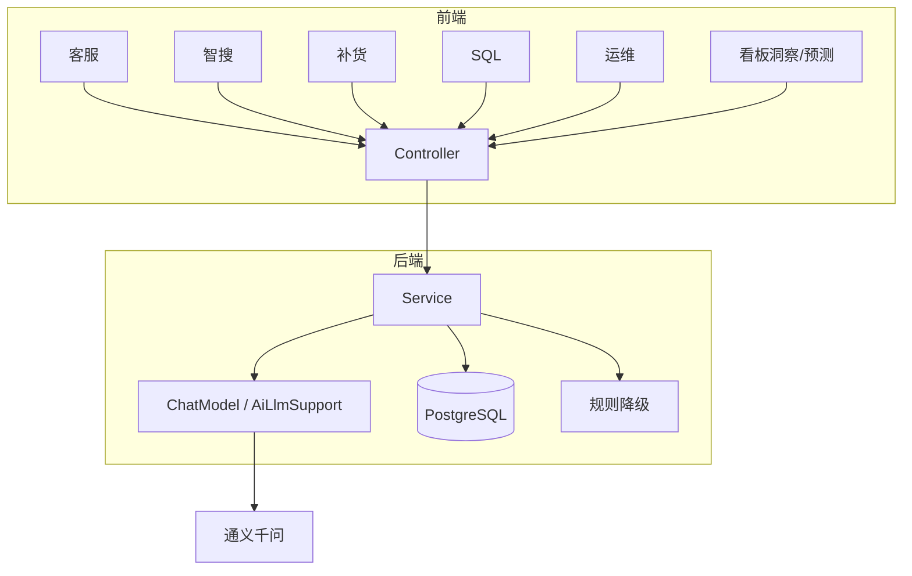

# 进销存项目 · AI 功能复习手册（现阶段全量）

> 用途：面试口述 / 联调对照 / 代码阅读路线图  
> 技术栈：Spring AI 1.0.0-M6 + 通义千问 DashScope（OpenAI 兼容）+ PostgreSQL + React 前端  
> 更新日期：2026-07-12  
> **LangChain 对照：** [`LangChain与SpringAI对照-复习手册.md`](./LangChain与SpringAI对照-复习手册.md) · 学习代码 `ai-service/.../learning/reference/`

---

## 一、总览：现阶段有哪些 AI

| # | 功能 | 入口（前端） | 接口 | 连库？ | LLM 主要干什么 | 降级 |
|---|------|-------------|------|--------|----------------|------|
| 1 | AI 智能客服 | 全局悬浮窗 | `POST /api/ai/chat` | 否（MVP） | 自然语言回答操作问题 | yml 固定话术 |
| 2 | AI 商品智搜 V1 | 商品列表页搜索条 | `POST /api/ai/product/parse` | 否 | NL → JSON 筛选条件 | 关键词规则 |
| 3 | AI 补货建议 | 库存预警页面板 | `GET /api/ai/inventory/replenish` | 是 | 润色 reason / risk | 纯规则结果 |
| 4 | AI SQL 助手 | 菜单「AI SQL助手」 | `POST /api/ai/sql/query` | 是 | 生成 SELECT + columns | 三套报表模板 |
| 5 | AI 运维助手 | 菜单「AI运维助手」 | `GET /api/ai/ops/analyze` | 是 | 写 analysis / solution | 规则定级+模板文案 |
| 6 | AI 看板洞察 | **嵌在首页看板**（无独立菜单） | `GET /api/ai/dashboard/insight` | 是 | 润色 suggestion 等 | 规则算 healthScore |
| 7 | AI 销售预测 | **嵌在首页销售趋势图**（7 日） | `GET /api/ai/dashboard/sales-forecast` | 是 | 生成 7 点预测曲线 | 线性外推 |

**规划中 / 进行中：** 智搜 V2 已落地 Embedding + pgvector TopK + RAG 生成；后续可补商品 CRUD 同步向量、库存条件筛选。  
**执行顺序与时间表：** [`AI应用开发-最小学习路线.md`](./AI应用开发-最小学习路线.md)  
**建表 SQL：** [`sql/v2_goods_search_embedding.sql`](./sql/v2_goods_search_embedding.sql)  
**旁路/业务接口（ai-service）：**  
- `POST /api/ai/goods/reindex-embedding` 重建向量  
- `GET /api/ai/goods/semantic-search?q=` 语义 TopK  
**前端：** 商品列表 → AI 搜索栏「语义搜索」模式（V1 条件智搜仍保留）




### 一句话架构

```text
前端请求（需 JWT）
  → Controller（@Valid / @RateLimit）
  → Service
      ├─ 业务查库 / 规则计算（可信数据）
      ├─ 拼 Prompt（System + User [+ 客服 History]）
      ├─ ChatModel.call 或 AiLlmSupport.callText
      ├─ 解析约定格式（JSON / 纯文本）
      ├─ 校验 / 选择性合并（防幻觉）
      └─ 失败 → 规则降级
  → 返回 VO 给前端
```

**后端共性职责：** 业务处理、数据校验、约定格式解析、兜底策略。  
**LLM 共性职责：** 理解自然语言 / 生成文案或结构化文本；**不能单独当可信数据源**。

---

## 二、共享基础设施（先记这个，再背各功能）

### 2.1 模型接入（application.yml）

```yaml
spring.ai.openai:
  api-key: ${DASHSCOPE_API_KEY:}          # 环境变量，勿写仓库
  base-url: https://dashscope.aliyuncs.com/compatible-mode
  chat.options:
    model: qwen-turbo
    temperature: 0.3                      # 偏低：结构化输出更稳

inventory.ai:
  chat:                                   # 客服专用
    max-history-messages: 20
    fallback-reply: ...
    session-store: memory                 # 或 redis
  sql:                                    # SQL 助手专用
    max-rows: 100
    allowed-tables: [goods_product, ...]
```

- 用的是 **ChatModel**（不是 ChatClient）。
- 配置前缀 `spring.ai.openai` 是「兼容 OpenAI 协议」，实际连的是阿里云 DashScope。
- `inventory.ai.*` 是**项目自定义** `@ConfigurationProperties`，框架不强制这个名字。

### 2.2 AiLlmSupport（共享调用层）

路径：`modules/ai/support/AiLlmSupport.java`

| 方法 | 作用 |
|------|------|
| `isApiKeyConfigured()` | 有无 Key；无则各业务走规则 |
| `callText(system, user)` | System + User 单次调用，返回纯文本；失败返回空串 |
| `parseJsonTree` / `extractJson` | 从模型输出抠 JSON（含 ```json 代码块） |
| `textOrNull` / `intOrNull` | 安全读字段 |

**谁用它：** 补货、SQL、运维、看板。  
**谁没用它：** 客服、智搜 V1（自己注入 `ChatModel`，客服还要多轮历史）。

### 2.3 Prompt 常量

各场景 System 提示词在：`modules/ai/constant/*Prompts.java`  
约定输出格式（尤其 JSON）写在 Prompt 里——**约定不是硬保证**，所以后端必须解析失败可降级。

### 2.4 鉴权与限流

- AI 接口**不在白名单**：需登录 JWT。
- Controller 上普遍有 `@RateLimit`，防刷 Token。
- 前端 AI 接口超时已统一拉长到 **120s**（LLM 常超过默认 10s）。

### 2.5 三种「LLM 用法」模式（面试高频）

| 模式 | 代表功能 | 特点 |
|------|----------|------|
| A. 纯对话 | 客服 | 多轮 History；返回自然语言；不查库 |
| B. 结构化解析 | 智搜 V1 | NL → JSON；结果交给现有业务接口 |
| C. 业务数据 + LLM 增强 | 补货/运维/看板 | 先查库/规则，再让模型润色或外推 |
| D. Text-to-SQL | SQL 助手 | 模型生成 SQL，**必须安全校验后才能执行** |

---

## 三、分类详解

---

### 分类 1：对话类 —— AI 智能客服

#### 做什么

进销存操作引导问答（怎么下单、怎么查库存等）。MVP **不查实时库存/订单**，避免幻觉数字。

#### 前端

- 全局悬浮客服窗；`useAiChat` → `aiApi.chat`
- 首轮不带 `sessionId`，响应带回后多轮原样携带

#### 后端实现链路

```text
AiChatController
  → AiChatServiceImpl.chat
      → resolveSessionId（新 UUID 或沿用）
      → 无 Key → fallback-reply（仍可写 session）
      → callModel：System + getHistory + 本轮 User
      → ChatModel.call(Prompt)
      → appendTurn（成功才写入历史）
      → 返回 { sessionId, reply }
```

#### 关键类与配置

| 文件 | 职责 |
|------|------|
| `AiChatPrompts` | 客服角色、边界、防幻觉 |
| `ChatSessionStore` | 接口：读历史 / 追加一轮 |
| `InMemoryChatSessionStore` | JVM Map；单机；超长裁剪 |
| `RedisChatSessionStore` | 多实例共享；TTL |
| `AiChatProperties` | maxHistory、fallback、session-store |

#### 消息怎么拼

1. `SystemMessage(AiChatPrompts…)`  
2. 历史中的 User / Assistant（不含 System）  
3. 本轮 `UserMessage`  

#### 降级

- Key 未配置 / 调用异常 → `inventory.ai.chat.fallback-reply`
- 不向上抛 500（尽量给前端友好文案）

#### 口述要点

「多轮靠 sessionId + ChatSessionStore；Prompt 限定只答进销存操作；不接 DB 防编造库存。」

---

### 分类 2：意图解析类 —— AI 商品智搜 V1

#### 做什么

用户说自然语言（如「查询已下架的鼠标」），解析成商品列表可用的筛选条件；**真正查商品仍走原商品列表 API**。

#### 前端

- 商品页 `AiProductSearchBar` + `useAiProductSearch`
- 拿到 `filters` 写入列表查询参数；展示 `insight`

#### 后端实现链路

```text
AiProductSearchController
  → AiProductSearchServiceImpl.parse
      → 无 Key → ruleBasedFallback
      → Prompt：System(解析器+JSON规范) + User(原话)
      → ChatModel.call
      → parseModelJson（extractJson → readTree → 填 VO）
      → normalize（全空则 keyword 兜底）
      → 失败 → ruleBasedFallback
```

#### 返回结构（约定）

```json
{
  "insight": "展示用文案",
  "filters": {
    "keyword": "鼠标",
    "shelfStatus": 0,
    "sortField": "salePrice",
    "sortOrder": "desc"
  },
  "stockHint": "可选，列表可能筛不了库存"
}
```

#### 规则降级做什么

- 「下架/上架」→ shelfStatus  
- 演示词表（鼠标、键盘…）→ keyword  
- 「库存低于 N」→ 仅 stockHint  
- 「销量高」→ 演示用售价降序  
- 都没命中 → 整句截断作 keyword  

#### 与 V2 区别

| V1（已实现） | V2（规划） |
|--------------|------------|
| NL → filters，无向量库 | Embedding + 向量检索（RAG） |
| 不查商品库做语义匹配 | 语义搜商品/文档知识 |

#### 口述要点

「智搜 V1 是翻译成筛选工单，不是直接搜库；客服是口头回答，智搜是结构化输出。」

---

### 分类 3：规则打底 + LLM 润色 —— 补货 / 运维 / 看板

共性：**可信字段来自 DB 或规则；LLM 只改文案或辅助字段；无 Key 也能用。**

---

#### 3.1 AI 库存补货建议

**做什么：** 对低于预警线的商品，给出建议采购量、风险、原因说明。

**前端：** 库存预警页 `AiReplenishPanel` / `useAiReplenish`（非独立菜单）。

**实现：**

```text
1. 查 inventory_stock：stock < stock_warn，最多 20，按库存升序
2. buildRuleItem：算 suggestQty、riskLevel、默认 reason
3. 无 Key → 直接返回规则列表
4. 有 Key → writeValueAsString(base) 当 User 上下文
     → callText(AiReplenishPrompts, context)
     → mergeLlmResult：只覆盖 reason / riskLevel
5. 按 high → medium → low 排序
```

**建议量规则（面试可背）：**

- `suggestQty = max(warn * 2 - current, warn)`
- `current <= warn/2` → high；`< warn` → medium；否则 low

**防幻觉关键：** `mergeLlmResult` **不读、不改** `currentStock` / `suggestQty`。

---

#### 3.2 AI 运维助手

**做什么：** 读最近操作日志，标 level/risk，并给出原因分析与处置建议。

**前端：** 菜单「AI运维助手」——左列表右详情。

**实现：**

```text
1. 查 sys_operation_log 最近 30 条
2. toRuleItem：规则定 level（失败 error；超时/慢 warn）
3. 模板写 analysis / solution
4. 有 Key → JSON 上下文 → LLM 润色 analysis/solution/risk/level
5. mergeLlm：有文案才覆盖；id/time/message 等事实字段保留
```

**注意：** 曾出现前端 10s 超时、后端 19s 才返回导致「连接被中止」——已把 AI 接口超时改为 120s。

---

#### 3.3 AI 看板洞察

**做什么：** 首页给老板「一句话运营结论」+ 健康分等。

**前端：** **嵌在数据看板**，`AiInsightMiniCard`；无独立「AI看板」菜单。

**实现：**

```text
1. 复用 DashboardIndexService.getDashboardIndexData(period)
2. buildRuleInsight：按预警数估 healthScore、replenishCount、suggestion
3. summarizeForLlm：压缩 stats/hotTop5/monitor，控 Token
4. LLM 可选覆盖 suggestion / 分数等字段
```

---

#### 3.4 AI 销售预测

**做什么：** 在 7 日销售趋势后追加「AI预测」虚线（演示向参考值）。

**前端：** `useSalesTrendWithForecast`；仅 `salesPeriod === '7d'` 时合并。

**实现：**

```text
1. 取看板 salesTrend 历史点
2. 规则：最近金额 × (1+2%×i) 外推 7 点（标签「预测一」…）
3. LLM：读历史 JSON，返回 ≥7 点数组则采用
4. 无 Key / 无历史 / 解析失败 → 规则外推
```

**产品口径：** AI 参考，非财务承诺。

---

### 分类 4：Text-to-SQL —— AI SQL 助手

#### 做什么

自然语言问数 → 生成只读 SELECT → 安全校验 → 执行 → 返回表格（sql + columns + rows）。

#### 前端

菜单「AI SQL助手」；展示生成的 SQL 与结果表。

#### 实现链路（最重要）

```text
AiSqlServiceImpl.query
  ├─ 有 Key：callText → 解析 { sql, columns }
  │     → tryExecute
  │           → AiSqlSafetyValidator.validate
  │           → ensureLimit
  │           → JdbcTemplate 查询
  │           → 截断 maxRows
  │           → 组装 VO
  └─ 任一步失败 / 无 Key → ruleFallback（三套固定 SQL）
```

#### 安全校验（AiSqlSafetyValidator）——面试必考

| 规则 | 目的 |
|------|------|
| SQL 非空 | 基本校验 |
| 禁止含 `;` | 防多语句（查完再删库） |
| 必须以 SELECT 开头 | 只读 |
| 黑名单关键字（INSERT/UPDATE/DELETE/DROP…） | 防写操作 |
| 至少命中一张 `allowed-tables` | 防越权查表 |

**原则：** Prompt 要求「只读」不够，**执行前必须代码校验**。

#### 规则降级三场景

1. 含「分类」+「库存」→ 按分类汇总库存  
2. 含「今日」+「订单/金额」→ 今日订单统计  
3. 默认 → 近 7 天销量 TOP10  

#### 口述要点

「LLM 负责写 SQL，后端负责闸门；校验不过或执行失败走模板，不裸奔执行。」

---

## 四、各功能对比速查（复习表）

| 维度 | 客服 | 智搜 V1 | 补货 | SQL | 运维 | 洞察 | 预测 |
|------|------|---------|------|-----|------|------|------|
| 多轮历史 | ✅ | ❌ | ❌ | ❌ | ❌ | ❌ | ❌ |
| 查业务库 | ❌ | ❌ | ✅ | ✅ | ✅ | ✅ | ✅ |
| 输出形态 | 文本 | JSON filters | VO 列表 | sql+表 | VO 列表 | VO | 7 点 |
| LLM 角色 | 回答 | 解析意图 | 润色 | 生成 SQL | 解释日志 | 润色 | 外推曲线 |
| 最特殊点 | SessionStore | 不改列表 API | 数字锁定 | SafetyValidator | 限 30 条 | 嵌看板 | 仅 7d 展示 |

---

## 五、前端 API 与页面对照

文件：`store-inventory-front/src/api/modules/ai.ts`（统一 `timeout: 120000`）

| API 方法 | 页面/组件 |
|----------|-----------|
| `chat` | 悬浮客服 `useAiChat` |
| `parseProductSearch` | 商品页智搜条 |
| `replenishAdvice` | 预警页补货面板 |
| `sqlQuery` | `/ai/sql` |
| `opsAnalyze` | `/ai/ops` |
| `dashboardInsight` | 首页 `AiInsightMiniCard` |
| `salesForecast` | 首页销售趋势图 AI 虚线 |

独立菜单仅：**AI SQL助手、AI运维助手**；其余嵌在业务页或全局组件。

---

## 六、代码阅读顺序（建议）

1. `application.yml`（Key、模型、inventory.ai）  
2. 客服：`AiChatServiceImpl` + `InMemoryChatSessionStore`  
3. 智搜：`AiProductSearchServiceImpl`  
4. 共享：`AiLlmSupport`  
5. 补货：`AiInventoryServiceImpl`（理解 merge）  
6. SQL：`AiSqlServiceImpl` + `AiSqlSafetyValidator`  
7. 运维 / 看板：扫主流程即可  

---

## 七、面试口述模板（压缩版）

**30 秒总述（客服开场可用）：**  
「指引型智能客服：Spring AI 1.0 M6 经 OpenAI 兼容端点接通义 qwen-turbo；Controller 鉴权限流，Service 拼 System+历史+User 调 ChatModel；sessionId 多轮存 ChatSessionStore（默认内存，可选 Redis+TTL）；失败 fallback。前端 sessionIdRef 回传、打字机展示。不查实时库存；RAG/Tool 是下一阶段。」

**全功能总述：**  
「项目用 Spring AI 对接通义，覆盖客服、智搜、补货、SQL、运维、看板。统一模式是 Prompt + ChatModel + 约定格式解析；后端负责业务数据、校验和降级。可信数字来自 DB/规则，模型做语言理解、结构化解析或文案增强。」

**防幻觉 / 降级 / 下一步：** 数字锁定与 SQL 校验；无 Key/超时/非法 JSON 走规则；规划智搜 V2 RAG，微服务后再上向量检索。

---

## 八、知识点汇总（概念速查）

| 概念 | 一句话 | 本项目落点 |
|------|--------|------------|
| LLM | 大语言模型 | 通义 `qwen-turbo` |
| Prompt | 发给模型的指令与上下文 | `*Prompts.java` |
| System / User / Assistant | 消息角色 | 客服三层拼装；其它多为 System+User |
| temperature | 随机性，越低越稳 | yml `0.3` |
| Token | 计费与长度单位 | 限流、裁剪历史 |
| 结构化输出 | 约定 JSON 便于程序解析 | 智搜、SQL、补货等 |
| 幻觉 | 模型编造事实 | 数字走 DB，LLM 写文案 |
| 降级 / fallback | 失败友好兜底 | 规则模板 + fallback-reply |
| ChatModel | Spring AI 单次 `call(Prompt)` | **不内置多轮** |
| DashScope / 百炼 | 阿里云通义 HTTP API | `base-url` 指向 compatible-mode |
| OpenAI 兼容 | 协议同 Chat Completions | 用 openai-starter 接通义 |
| sessionId | 业务会话 ID | 关联多轮历史 |
| TTL | Redis Key 存活时间 | `session-ttl-seconds` |
| RAG | 检索增强生成 | 智搜 V2 规划 |
| SSE | 服务端推送流式 | 未做；打字机≠流式 |
| 策略模式 | 接口多实现可替换 | `ChatSessionStore` |
| DTO / VO | 入参 / 出参 | `*RequestDTO` / `*VO` |

### Spring AI 关系链

```text
ChatModel（接口）
  → OpenAiChatModel（starter 实现）
  → HTTP → DashScope compatible-mode
  → 通义 qwen-turbo
```

**为什么 pom 是 openai-starter 却接通义？**  
DashScope 提供 OpenAI 兼容端点，改 `base-url` + `api-key` 即可，不必通义专用 SDK。Starter 自动拼 `/v1/chat/completions`。

**配置两层：**

| 前缀 | 作用 |
|------|------|
| `spring.ai.openai.*` | 连模型（Key、URL、model、temperature） |
| `inventory.ai.chat.*` / `inventory.ai.sql.*` | 业务规则（历史条数、fallback、表白名单） |

**Maven 注意：** Spring AI M6 需 `spring-milestones` 仓库；要求 Boot 3 + JDK 17+。老项目 Boot2/JDK8 不能用 Spring AI 1.x，可改原生 HTTP/SDK。

### RAG（智搜 V2 规划）

文档切片 → Embedding 成向量 → 向量库（pgvector/Milvus 等）→ 问句 TopK 检索 → 结果塞进 Prompt 再生成。  
**向量库存知识片段，不存普通聊天流水**（聊天用 Redis/DB）。

### Tool / Function Calling（客服进阶）

模型决定调哪个函数（如 `queryStock`），执行后结果回灌 Prompt，客服从「只会说」升级为「能查真实数据」。当前 MVP 未做。

### 成本与观测

限流、缩短 Prompt、裁剪历史控 Token；可记 latency/降级次数；敏感操作用现有 `sys_operation_log`。

---

## 九、客服深挖（五站 + 必背问答）

> 客服是唯一多轮能力，面试问得最细；以下由原「学习站点 / 面试题」合并精简。

### 9.1 五站地图

```text
第一站  依赖+配置 → pom / spring.ai.openai / AiChatProperties
第二站  HTTP 入口 → AiChatController、JWT、@RateLimit、@Valid
第三站  核心业务 → resolveSessionId → 拼 Prompt → call → 降级
第四站  多轮会话 → ChatSessionStore（memory / redis）
第五站  前后端约定 → DTO/VO、sessionIdRef、打字机 UX
```

### 9.2 必背问答（精选）

**Q：客服什么类型？能查库存吗？**  
指引型 MVP，只答操作路径；Prompt 禁止编造库存/订单号/价格。查库需 Tool Calling。

**Q：ChatModel 自带多轮吗？**  
不带。每次 HTTP 无状态；多轮靠 sessionId + Store 把历史塞进 Prompt。

**Q：Prompt 三种消息顺序？**  
① System（每次新建，不存 Store）→ ② History → ③ 本轮 User。

**Q：哪些走 fallback？**  
Key 空、call 异常、返回空文本 → `fallback-reply`；通常仍 HTTP 200，优雅降级。

**Q：为什么 appendTurn 在 call 成功之后？**  
避免失败时历史留下「有问无答」，污染下一轮。

**Q：必须登录？1102？**  
`/ai/chat` 不在白名单。1102 且 msg 空常见原因：未带 `Authorization: Bearer ...`。

**Q：为什么要 RateLimit？**  
烧 Token、有 QPS；JWT 防未登录，限流防刷。

**Q：@Valid 和降级区别？**  
Valid 拦非法入参（进 Service 前）；降级是模型/Key 失败后的业务兜底。

**Q：内存会话风险？**  
单会话最多约 20 条消息不大；风险是 session 只增不减、重启丢、多实例不共享 → 生产 Redis+TTL。

**Q：向量库能存对话吗？**  
不能。Redis 存聊天记录；向量库存 RAG 知识。

**Q：打字机是流式吗？**  
不是。后端一次返回完整 reply；前端 `setTimeout` 逐字是 UX。SSE 未做。

**Q：sessionId 谁生成、前端哪存？**  
首轮服务端 UUID；前端 `useAiChat` 的 `sessionIdRef` 回传。

**Q：怎么验真 AI？**  
Network 看真实 POST；关后端应失败；去 Key 应变为固定 fallback。

**Q：为什么选 Spring AI 不全用 LangChain4j？**  
客服/SQL 用 Spring AI 集成简单；智搜 RAG 规划可用 LangChain4j 做切片与向量链，按场景分工。

**Q：M6 生产敢用吗？**  
Milestone，demo/求职可；公司要 GA 可升级或换 SDK。核心依赖 `ChatModel` 接口便于替换。

**Q：Redis 版为何用 ChatHistoryEntry？**  
`Message` 序列化不稳；存 `role+content` POJO，读回再转 Message。

### 9.3 ChatSessionStore 要点

| 方法 | 作用 |
|------|------|
| `getHistory` | 读 User/Assistant（无 System） |
| `appendTurn` | 追加一轮并裁剪 |
| `clear` | 清空（前端「新对话」可接） |

- 内存：`ConcurrentHashMap` + 同 session `synchronized`  
- Redis：`session-store: redis`，TTL 每次 append 续期；与内存版 `@ConditionalOnProperty` 互斥  
- `max-history-messages: 20` 是**消息条数**（约 10 轮），超出删头部  

---

## 十、环境检查与联调清单

```powershell
# API Key（PowerShell 临时）
$env:DASHSCOPE_API_KEY="sk-xxx"
# 永久：系统环境变量 → 重启 IDEA / 终端
```

| 检查项 | 说明 |
|--------|------|
| PostgreSQL | `inventory_store`；有库存/订单/操作日志数据更易演示 |
| 后端 | 端口 8080，context-path `/api` |
| 前端 | 登录后带 JWT；AI 接口超时 120s |

| 页面 | 期望接口 |
|------|----------|
| 全局客服 | `POST /ai/chat` → reply |
| 商品智搜 | `POST /ai/product/parse` → filters |
| 库存预警 | `GET /ai/inventory/replenish` → 数组 |
| AI SQL | `POST /ai/sql/query` → rows |
| AI 运维 | `GET /ai/ops/analyze` → logs |
| 工作台 | `GET /ai/dashboard/insight` + `sales-forecast` |

**运维超时说明：** LLM 分析 30 条日志可能 >10s；前端已统一 AI 超时 120s，否则会出现客户端断开、后端 `AsyncRequestNotUsableException`。

---

## 十一、后续演进清单

1. 智搜 V2 RAG（pgvector + 商品描述索引）  
2. 客服 Tool Calling（查库存/订单）  
3. SSE 流式回复  
4. 前端「新对话」+ 后端 `clear` API  
5. 微服务拆订单/库存后再做向量检索  

---

## 十二、闭卷自测（精选）

1. 为什么 openai-starter 能接通义？  
2. 多轮是 ChatModel 内置的吗？Prompt 三种消息顺序？  
3. Key 空会调通义吗？appendTurn 为何在成功之后？  
4. 补货 merge 改哪些字段？为什么？  
5. SQL 安全校验有哪几条？  
6. 向量库能替代 Redis 存对话吗？  
7. 打字机说明后端流式吗？  
8. 看板 AI 有独立菜单吗？在哪看？  
9. 智搜 V1 和 V2 差在哪？  
10. `@Valid` 和 fallback 区别？

（答案见上文对应章节。）

---

## 十三、代码索引

| 主题 | 路径（均在 `modules/ai` 或前端 `src`） |
|------|------|
| 配置 | `application.yml`、`AiChatProperties`、`AiSqlProperties` |
| 共享 | `AiLlmSupport`、`AiSqlSafetyValidator` |
| 客服 | `AiChatController`、`AiChatServiceImpl`、`AiChatPrompts`、`*ChatSessionStore` |
| 智搜 | `AiProductSearch*` |
| 补货 | `AiInventory*`、`AiReplenishPrompts` |
| SQL | `AiSql*` |
| 运维 | `AiOps*` |
| 看板 | `AiDashboard*` |
| 前端 API | `api/modules/ai.ts`、`api/types/ai.ts` |
| 前端页面 | `useAiChat`、`useAiProductSearch`、`useAiReplenish`、`views/ai/sql`、`views/ai/ops`、`useDashboardPage` |

---

*本文为现阶段 AI 唯一复习文档；读完应能按分类讲清「做什么 / 怎么调模型 / 后端守什么门 / 失败怎么办」。*
