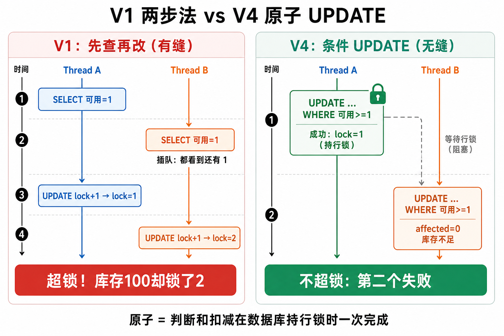

# V1 两步法 vs V4 原子 UPDATE（配图说明）

彩色对比图：



> 若图片尚未拷到本目录，也可看仓库外生成图，或直接看下方文字版时间线。

---

## 文字版时间线

### V1：先查再改（中间有缝）

```text
时间 →

线程A:  [查：还有1] -------------------- [lock+1 成功]
线程B: -------- [查：还有1] -------------------- [lock+1 成功]
                 ↑
            两人都看到「还有1」→ 超锁
```

### V4：一条条件 UPDATE（无缝）

```text
时间 →

线程A:  [行锁] UPDATE … WHERE 可用>=1  → 成功，lock+1
线程B:  ........等待........ UPDATE … WHERE 可用>=1  → 0行，失败
```

**原子** = 判断够不够 + 扣库存，在数据库持行锁时一次做完。
