# 业务流转图

> 本文档描述门店库存管理系统核心业务的流转逻辑，基于当前代码实现整理。

---

## 1. 用户认证流转

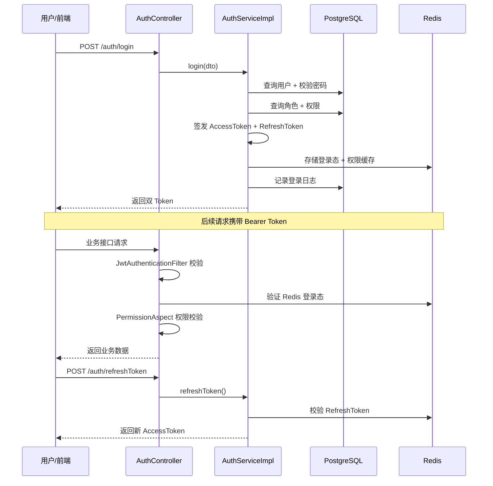

---

## 2. RBAC 权限分配流转

```mermaid
flowchart TD
    A[管理员登录] --> B[用户管理]
    B --> C{操作类型}
    C -->|创建用户| D[POST /sysUser]
    C -->|分配角色| E[POST /sysUser/{userId}/role]
    E --> F[写入 sys_user_role]
    F --> G[清除 user:perm 缓存]

    A --> H[角色管理]
    H --> I[POST /sysRole/{roleId}/permission]
    I --> J[先删后插 sys_role_permission]
    J --> G

    A --> K[权限管理]
    K --> L[维护 sys_permission 树]
    L --> M[M目录 / C菜单 / F按钮]

    G --> N[用户下次请求重新加载权限]
```

---

## 3. 商品管理流转

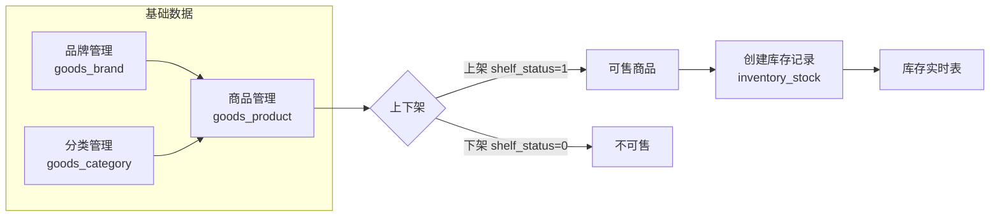

**商品新增联动**：

1. 新增 `goods_product` 记录
2. 同步初始化 `inventory_stock`（库存为 0，状态=缺货或正常）
3. 设置 `stock_warn` 预警阈值

---

## 4. 库存管理流转

### 4.1 入库流程

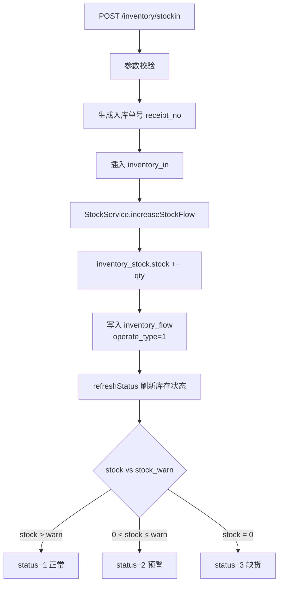

### 4.2 出库流程

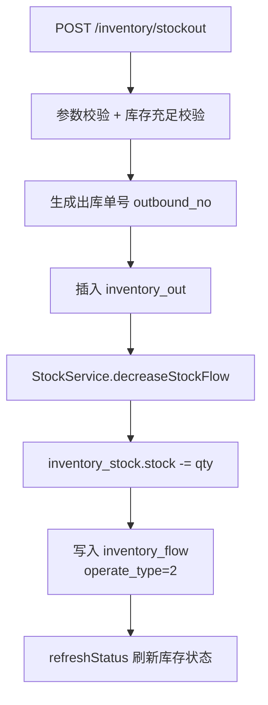

### 4.3 库存操作类型

| operate_type | 场景 | 库存变动 |
|--------------|------|----------|
| 1 | 入库 | stock + qty |
| 2 | 出库 | stock - qty |
| 3 | 锁定（下单） | lock_stock + qty |
| 4 | 解锁（取消） | lock_stock - qty |
| 5 | 调整 | 手动调整 |

---

## 5. 订单全生命周期流转

### 5.1 订单状态机

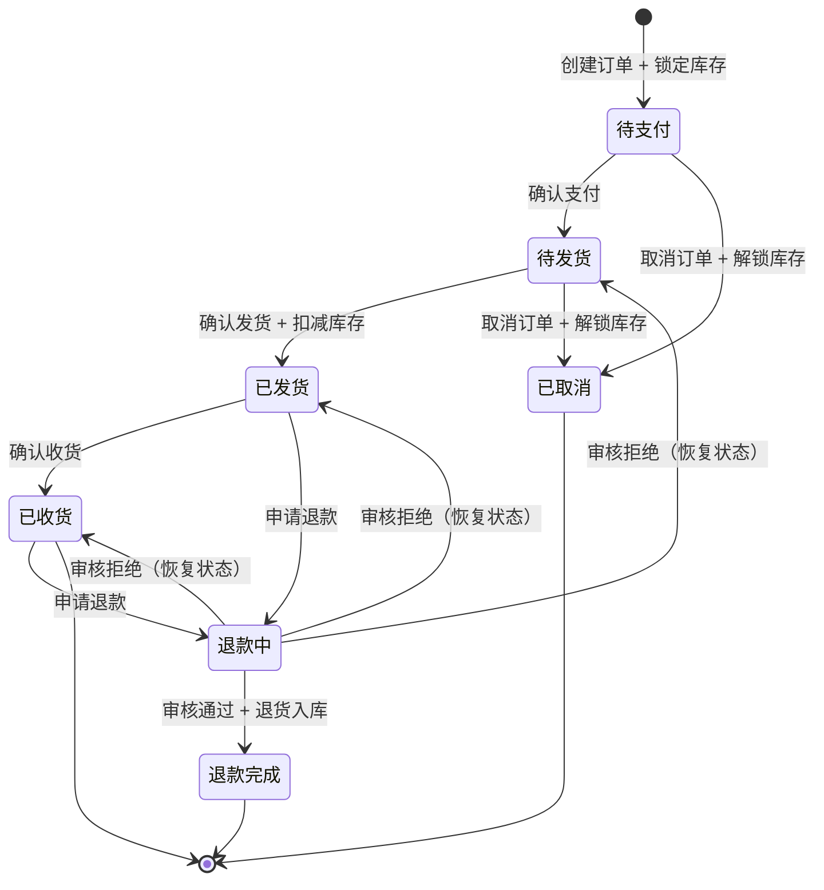

### 5.2 创建订单

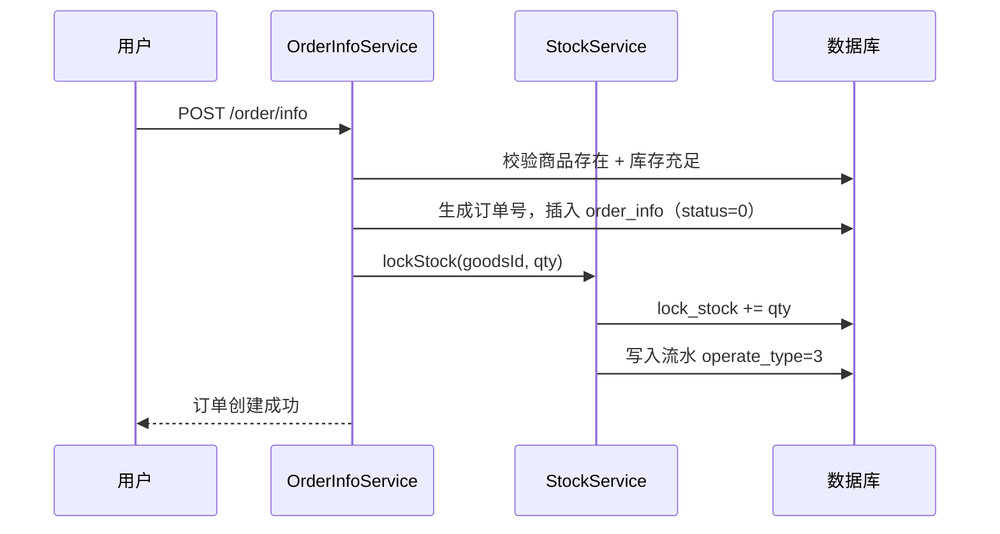

### 5.3 支付 → 发货 → 收货

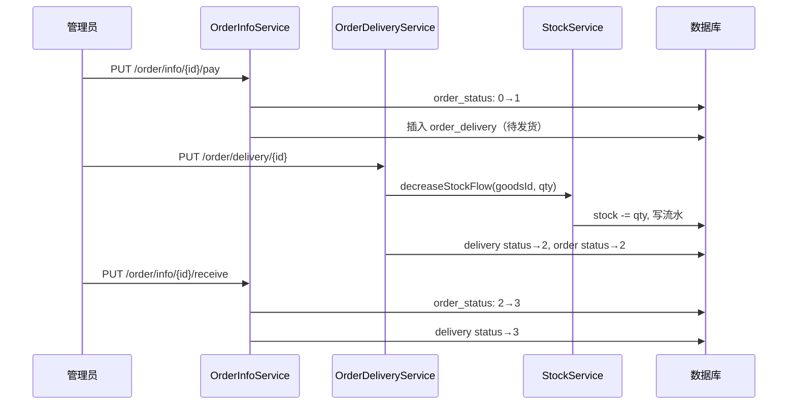

### 5.4 退款流程

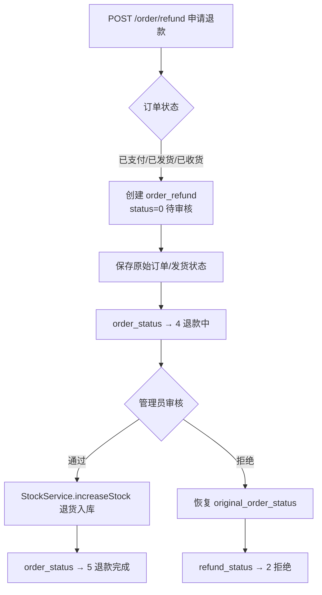

---

## 6. 门店收银流转

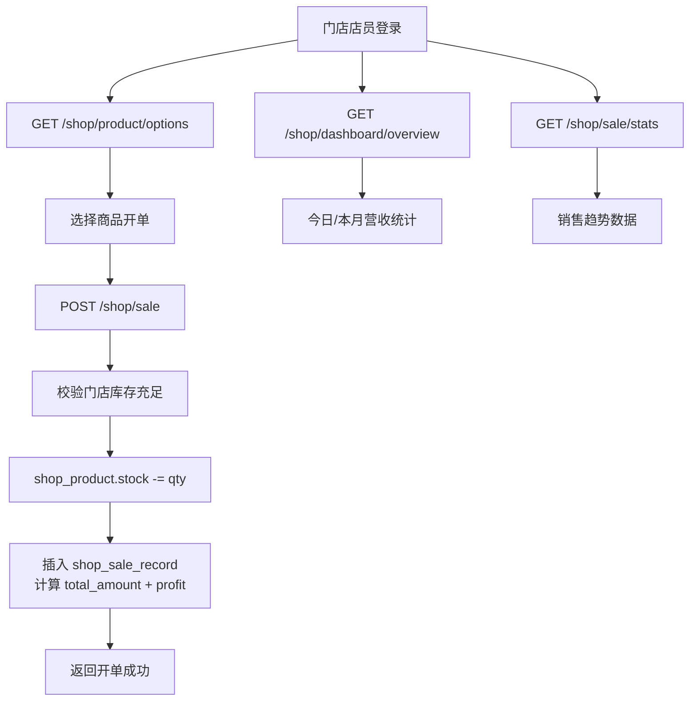

> 门店模块独立于主订单体系，使用 `shop_product` + `shop_sale_record` 轻量记账。

---

## 7. 操作审计流转

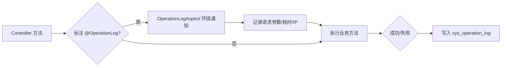

---

## 8. API 监控流转

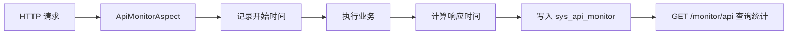

---

## 9. 业务模块依赖关系

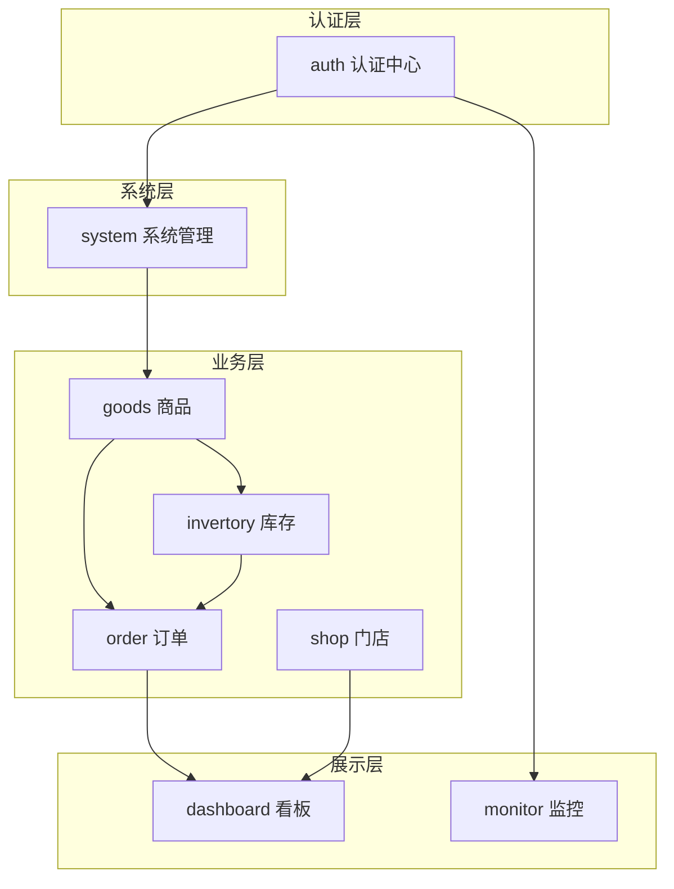

---

## 10. 关键业务规则汇总

| 业务 | 规则 |
|------|------|
| 下单 | 创建订单时锁定库存，防止超卖 |
| 支付 | 仅待支付订单可支付，支付后生成发货单 |
| 发货 | 仅待发货可发货，发货时扣减真实库存 |
| 取消 | 待支付/待发货可取消，释放锁定库存 |
| 退款 | 已支付/已发货/已收货可申请，通过后退货入库 |
| 入库 | 事务保证：入库单 + 库存增加 + 流水记录 |
| 出库 | 事务保证：出库单 + 库存扣减 + 流水记录，库存不足拒绝 |
| 预警 | stock ≤ stock_warn 且 > 0 为预警，stock = 0 为缺货 |
| 注册 | 自动绑定普通用户角色（roleId=3） |
| 权限变更 | 清除 Redis 权限缓存，下次请求生效 |
