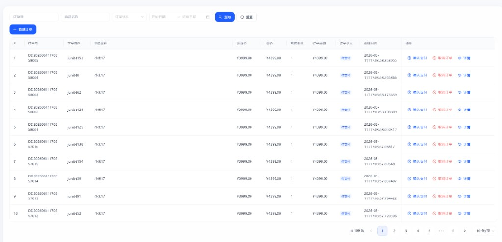
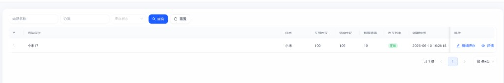

# 库存并发演进 V1～V7

> 实验接口：新增订单锁库存  
> - 正式：`POST /api/order/info/add`  
> - 压测（仅 dev）：`POST /api/order/concurrency/order/add?version=v1`

---

## 压测辅助接口（仅 dev 环境）

| 接口 | 说明 |
|------|------|
| `POST /api/order/concurrency/order/add?version=v1` | 按版本创建订单 |
| `POST /api/order/concurrency/stock/reset` | 重置 stock / lockStock |
| `GET /api/order/concurrency/stock/result` | 查询压测结果快照 |
| `GET /api/order/concurrency/versions` | 已注册版本列表 |

代码位置：`com.inventory.modules.order.concurrency`（v1～v7 + facade + dev）

---

## 实验场景

| 项 | 值 |
|----|-----|
| 接口 | `POST /api/order/info/add` |
| 商品 | 小米17 |
| goodsId | `2064625692771397632` |
| 初始当前库存 | 100 |
| 初始锁定库存 | 0 |
| 每单购买数量 | 1 |
| 计划并发数 | 200 |

### 请求体示例

```json
{
  "userName": "压测用户",
  "goodsId": "2064625692771397632",
  "goodsName": "小米17",
  "costPrice": 3999,
  "salePrice": 4399,
  "buyQty": 1,
  "orderAmount": 4399,
  "remark": "并发实验"
}
```

---

## 版本说明

| 版本 | 方案 | 状态 |
|------|------|------|
| V1 | 单线程基础版（无并发控制，即当前单体实现） | 基线 |
| V2 | JUC 基础并发（ReentrantLock 按商品互斥） | 已压测（JMeter），单机不超锁 |
| V3 | 线程池（任务拆分 + 异步） | 待做 |
| V4 | SQL 并发控制（库存安全） | 待做 |
| V5 | Redis 并发控制（分布式锁 / 原子扣减） | 待做 |
| V6 | MQ 最终一致性（异步解耦） | 待做 |
| V7 | 幂等 + 补偿机制（生产级） | 待做 |

---

## 压测结果对比

| 版本 | 并发 | 成功订单数 | 当前库存 | 锁定库存 | 是否超锁 | 日期 | 备注 |
|------|------|------------|----------|----------|----------|------|------|
| V1 | 200 | 109（JUnit 3 轮 + JMeter 一致） | 100 | 109 | 是（usable=-9） | 2026-06-11～12 | JUnit + JMeter HTTP 均复现超锁 |
| V2 | 200 | 100（JMeter） | 100 | 100 | 否（usable=0） | 2026-06-12 | JMeter HTTP；库存流水 100 条；响应慢于 V1（见下） |

#### V1 多轮压测明细

| 轮次 | 时间 | 成功 | 失败 | lockStock | usable | 超锁 |
|------|------|------|------|-----------|--------|------|
| 第 1 次 | 17:03 | 109 | 91 | 109 | -9 | 是 |
| 第 2 次 | 18:47 | 109 | 91 | 109 | -9 | 是 |
| 第 3 次 | — | 109 | 91 | 109 | -9 | 是（与上两轮相同，不重复记录） |

> 三轮结果完全一致，V1 基线可收口：本机 200 并发下稳定超额 9 单。

#### V2 压测明细（2026-06-12）

| 轮次 | 工具 | 成功 | 失败 | lockStock | usable | 超锁 | 库存流水 |
|------|------|------|------|-----------|--------|------|----------|
| 第 1 次 | JMeter | 100 | 100 | 100 | 0 | 否 | 100 条 |

> V2 业务目标达成：成功数 = 初始库存 100，不再出现 V1 的 109/91。代价是同一商品在锁上串行，HTTP 平均响应与吞吐明显差于 V1（见 JMeter 对比）。

#### V1 vs V2 性能对比（JMeter，200 并发，本机）

| 指标 | V1 | V2 | 说明 |
|------|----|----|------|
| 业务成功 / 失败 | 109 / 91 | **100 / 100** | V2 正确；V1 超锁 9 单 |
| lockStock | 109 | **100** | — |
| HTTP 异常 % | 0% | 0% | 均 200 OK；失败为业务 body |
| 平均响应 | ~4867 ms | **~21162 ms** | V2 请求在 ReentrantLock 上排队 |
| 最小 / 最大 | — / ~6773 ms | **~261 ms / ~35868 ms** | V2 先完成的快、排后面的慢 |
| 吞吐量 | ~26.3/sec | **~5.4/sec** | 串行导致吞吐下降 |

**结论：** V2 用「按 goodsId 互斥串行 createOrder」换「不超锁」；单机正确性验证完成，性能优化留给 V4（缩短 SQL 临界区）、V6（异步）等版本。

### V1 压测佐证（2026-06-11）

**JUnit 控制台输出：**

```
并发线程数: 200
成功下单数: 109
失败次数:   91
当前库存 stock:     100
锁定库存 lockStock: 109
可用库存 usable:    -9
待支付订单数:       109
是否疑似超锁:       true
```

**前端页面截图：**

订单列表：共 109 条待支付订单（下单用户 `junit-t*`，创建时间 2026-06-11 17:03:57～58）



库存列表：可用库存 100，锁定库存 109（超锁 9 件）



---

## JMeter HTTP 压测（dev）

### 测试计划结构

```
测试计划
 └── 线程组（线程数 200，Ramp-Up 1 秒，循环 1）
      ├── HTTP信息头管理器
      ├── HTTP请求
      ├── 汇总报告（推荐）
      └── 查看结果树（调试用，线程多时会卡）
```

### HTTP 信息头管理器

| 名称 | 值 |
|------|-----|
| `Content-Type` | `application/json` |
| `Authorization` | `Bearer {accessToken}`（登录接口获取，过期需重新登录） |

### HTTP 请求（必为 POST）

| 项 | 值 |
|----|-----|
| 方法 | **POST**（用 GET 会报 `Request method 'GET' is not supported`） |
| 协议 | `http` |
| 服务器 | `localhost` |
| 端口 | `8080` |
| 路径 | `/api/order/concurrency/order/add?version=v1` |

**Body Data（消息体数据）：**

```json
{
  "userName": "jmeter-t${__threadNum}",
  "goodsId": "2064625692771397632",
  "goodsName": "小米17",
  "costPrice": 3999,
  "salePrice": 4399,
  "buyQty": 1,
  "remark": "JMeter V1"
}
```

V2 压测：路径改为 `?version=v2`，其余相同。

### 压测前必做：清理 + 重置（否则 usable=-9，全部「库存不足」）

上次 JUnit/JMeter 若已超锁（lockStock=109），**不清理直接再压** 会返回：

```json
{"code":500,"message":"库存不足，当前可用库存：-9"}
```

说明 **POST 与 Token 已正常**，只是库存处于超锁残留状态，不是认证失败。

**方式 A：SQL（推荐，最干净）**

```sql
-- 1. 删除压测订单
DELETE FROM order_info
WHERE goods_id = 2064625692771397632
  AND (user_name LIKE 'junit-%' OR user_name LIKE 'jmeter-%');

-- 2. 重置库存
UPDATE inventory_stock
SET stock = 100,
    lock_stock = 0,
    update_time = NOW()
WHERE goods_id = 2064625692771397632;
```

**方式 B：HTTP 重置（需 Token，不删订单时 lockStock 仍可能不准）**

```
POST http://localhost:8080/api/order/concurrency/stock/reset?goodsId=2064625692771397632&stock=100&lockStock=0
Header: Authorization: Bearer {token}
```

**压测后核对：**

```
GET http://localhost:8080/api/order/concurrency/stock/result?goodsId=2064625692771397632
```

期望起点：`stock=100, lockStock=0, usable=100, overLocked=false`。

### 常见报错对照

| 现象 | 原因 | 处理 |
|------|------|------|
| `Request method 'GET' is not supported` | HTTP 方法仍是 GET | 改为 **POST** |
| `code: 1102` / Token 相关 | Token 过期或无效 | 重新登录换 Token |
| `code: 10500` 系统繁忙 | 服务端未捕获异常 | 看 IDEA 控制台栈信息 |
| `库存不足，当前可用库存：-9` | 未清理上次超锁数据 | 执行上方 SQL 后再压 |
| `code: 200` 且 msg 含「订单创建成功」 | 正常成功 | — |

> 说明：业务失败时 `code` 可能为 **500**（`ResultCode.FAIL`），与 HTTP 状态码不同；成功为 **code: 200**。

### JMeter 压测结果

| 版本 | 并发 | 业务成功 | 业务失败 | stock | lockStock | usable | 超锁 | 日期 | 备注 |
|------|------|----------|----------|-------|-----------|--------|------|------|------|
| V1 | 200 | 109 | 91 | 100 | 109 | -9 | 是 | 2026-06-12 | **有效轮次**，与 JUnit 一致 |
| V1 | — | — | — | 100 | 109 | -9 | — | 2026-06-12 | 未清库重跑，全部「库存不足 -9」，无效 |

#### V1 JMeter 有效轮次明细（2026-06-12）

**汇总报告（HTTP 层）：**

| #样本 | 异常% | 平均 ms | 最大 ms | 吞吐量 |
|-------|-------|---------|---------|--------|
| 200 | 0.00% | 4867 | 6773 | 26.3/sec |

> HTTP 异常 0% 只表示状态码 200；业务成功/失败以 `stock/result` 与响应 body 中 `code` 为准。

**压测后 `GET /api/order/concurrency/stock/result`：**

```json
{
  "stock": 100,
  "lockStock": 109,
  "usableStock": -9,
  "pendingOrderCount": 109,
  "overLocked": true
}
```

**结论：** JMeter `POST ...?version=v1`、200 并发，与 JUnit 压测结果一致，**V1 HTTP 路径亦稳定复现超锁**；库存流水与待支付订单 `jmeter-t*` 共 109 条，可对照数据库验证。

#### V2 JMeter 有效轮次明细（2026-06-12）

**汇总报告（HTTP 层）：**

| #样本 | 异常% | 平均 ms | 最小 ms | 最大 ms | 吞吐量 |
|-------|-------|---------|---------|---------|--------|
| 200 | 0.00% | 21162 | 261 | 35868 | 5.4/sec |

> 最小值约 261 ms：较早拿到锁的请求；最大值约 36 s：排在队尾、等待前序 199 次 createOrder 完成。标准偏差大（~10518）是「锁排队」的典型特征。

**压测后 `GET /api/order/concurrency/stock/result`（预期）：**

```json
{
  "stock": 100,
  "lockStock": 100,
  "usableStock": 0,
  "pendingOrderCount": 100,
  "overLocked": false
}
```

**数据库核对：** 待支付订单 `jmeter-t*` 共 100 条；`inventory_stock_flow` 锁定流水 100 条；`lock_stock = 100`。

**结论：** JMeter `POST ...?version=v2`、200 并发，**业务 100 成功 / 100 失败，不超锁**；与 V1 对比证明 ReentrantLock 在单机 JVM 内有效，但响应时间与吞吐劣于 V1（正确性 vs 并行竞态的代价）。

---

## 判定标准

- **超锁**：成功订单数 > 100，或 `锁定库存 > 100`，或可用库存被抢成负数逻辑
- 压测前：将该商品 `锁定库存` 归零，清理测试订单（可选）
