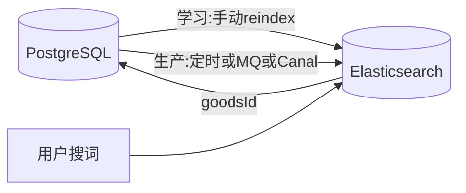
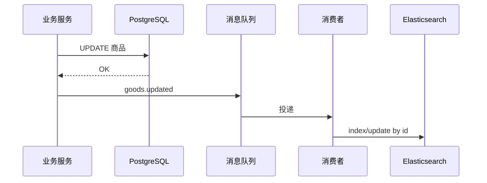

# 智搜与 Elasticsearch 面试笔记

> 目标岗位口述向；本机可演示最小检索。  
> **不要和并发锁库存、智搜 V2（RAG 向量）混为一谈。**

---

## 0. 和现有项目的关系

| 能力 | 做什么 | 本阶段 |
|------|--------|--------|
| AI 智搜 V1 | 自然语言 → LLM 解析成筛选条件 | 已有（`ai-service`） |
| **Elasticsearch** | 关键词/相关性快速找商品 | **本阶段接入** |
| 智搜 V2（RAG） | 向量语义检索 | 不做 |
| 并发 V1～V7 | 下单锁库存 | 叙事分开 |

```text
用户口语 ──▶ AI智搜V1 ──▶ 结构化筛选条件 ──▶ PostgreSQL（真相库）
                              │
                              └──（可选）关键词检索 ──▶ Elasticsearch（检索副本）
```

生活类比：**PostgreSQL 是仓库账本；ES 是商场导购目录。**  
目录可以稍后更新；结账、锁库存必须看账本。

---

## 1. ES 是什么？

**Elasticsearch** = 分布式**搜索与分析**引擎。

- 核心数据结构：**倒排索引**（词 → 有哪些文档/商品）  
- **不是**关系型数据库替身，**不能**当库存/订单主库  
- 擅长：全文检索、相关性排序、聚合统计

### 倒排索引（一句话）

正排：商品 → 有哪些词  
倒排：词 → 有哪些商品

```text
文档：
  商品A「小米17 手机」
  商品B「小米手环」

分词后倒排：
  小米 → [A, B]
  17   → [A]
  手机 → [A]
  手环 → [B]

搜「小米」→ 很快拿到 A、B，再按相关度排序
```

对比 PostgreSQL：`LIKE '%小米%'` 往往难走普通 B-Tree，大数据量会慢，分词/相关度也弱。

---

## 2. 业务场景（你们进销存）

适合用 ES：

- 商品名 / 规格 **模糊、分词** 搜索（「米」「小米17」）  
- 多字段相关度（名称命中 > 备注命中）  
- 聚合：按品牌/分类统计命中数量（进阶）

不适合 / 不要用 ES：

- 下单、锁库存、扣减（必须 PG + 你们 V4 条件 UPDATE）  
- 强事务、强一致金额账  

---

## 3. 有什么问题才要用？

| 问题 | 表现 | ES 怎么帮 |
|------|------|-----------|
| 模糊搜慢 | `LIKE '%xx%'` 全表扫 | 倒排秒级定位候选 |
| 搜不准 | 只能精确/前后缀，不懂「分词」 | analyzer 切词 + 相关度 |
| 多条件组合检索复杂 | SQL 越写越重 | bool query 组合灵活 |
| 日志排查（了解） | 海量日志 | ELK 一类方案 |

**面试口诀：** 交易走数据库，搜索走 ES；搜到 id 再回主库补实时库存也可。

---

## 4. 怎么用（心智模型）

```text
1. 建索引 + mapping（字段类型、是否分词）
2. 写入文档（商品快照）
3. search API（match / term / bool）
4. 拿 goodsId →（可选）回 PG 查最新库存/价格
```

学习版字段（索引 `goods_search`）：

| 字段 | 说明 |
|------|------|
| goodsId | 商品主键 |
| productName | 商品名（全文） |
| specModel | 规格（全文，可选） |
| categoryName / brandName | 分类/品牌 |
| shelfStatus | 上下架 |

---

## 5. 使用中要注意什么？

1. **一致性**：ES 是副本，和 PG **最终一致**；改商品后要同步（定时 / MQ / Canal）  
2. **勿当主库**：下单锁库存永远 PG  
3. **中文分词**：生产常用 IK；学习版可用默认 analyzer，搜英文/数字较稳，中文可演示但不够理想  
4. **资源**：ES 吃内存；2 核机器学习时按需启停，别和全家桶微服务同时猛开  
5. **安全**：生产要开认证/TLS；本机学习可关安全方便 curl  
6. **和智搜分工**：LLM 负责「听懂人话」；ES 负责「关键词找货」——可串联，也可独立演示  

---

## 6. 本机启动（Docker）

```bash
# 单节点、学习用（关闭安全，方便本机 curl）
docker run -d --name es-dev \
  -p 9200:9200 -p 9300:9300 \
  -e "discovery.type=single-node" \
  -e "xpack.security.enabled=false" \
  -e "ES_JAVA_OPTS=-Xms512m -Xmx512m" \
  docker.elastic.co/elasticsearch/elasticsearch:8.11.3
```

验证（本机已验证：`8.11.3`，`GET http://127.0.0.1:9200` 返回 cluster/version JSON）：

```bash
curl http://localhost:9200
# 应返回 name / version 等 JSON
```

停止 / 再起：

```bash
docker stop es-dev
docker start es-dev
```

---

## 7. 手工验证索引（curl）

### 建索引

```bash
curl -X PUT "http://localhost:9200/goods_search" -H "Content-Type: application/json" -d "{
  \"mappings\": {
    \"properties\": {
      \"goodsId\":      { \"type\": \"long\" },
      \"productName\":  { \"type\": \"text\" },
      \"specModel\":    { \"type\": \"text\" },
      \"categoryName\": { \"type\": \"keyword\" },
      \"brandName\":    { \"type\": \"keyword\" },
      \"shelfStatus\":  { \"type\": \"integer\" }
    }
  }
}"
```

### 写入样例

```bash
curl -X POST "http://localhost:9200/goods_search/_doc/1" -H "Content-Type: application/json" -d "{
  \"goodsId\": 1,
  \"productName\": \"小米17\",
  \"specModel\": \"256G\",
  \"categoryName\": \"手机\",
  \"brandName\": \"小米\",
  \"shelfStatus\": 1
}"
```

### 搜索

```bash
curl -X GET "http://localhost:9200/goods_search/_search" -H "Content-Type: application/json" -d "{
  \"query\": { \"match\": { \"productName\": \"小米\" } }
}"
```

---

## 8. 项目演示接口（platform-service）

| 方法 | 路径 | 说明 |
|------|------|------|
| POST | `/api/es/goods/reindex`（兼 `/api/dev/es/goods/reindex`） | 从 PG 拉商品写入 ES（学习用） |
| GET | `/api/es/goods/search?q=关键词` | 查 ES，返回 id + 名称等 |
| **业务入口** | 商品列表页 →「ES 关键词」→ `listByIds` 填表；可点「重建 ES 索引」 |

配置（dev）：`spring.elasticsearch.uris=http://127.0.0.1:9200`，`app.elasticsearch.enabled=true`  
生产：`app.elasticsearch.enabled=false`（不装配演示 Bean）。

**不替换**正式商品列表与下单链路。

演示步骤：

```text
1. docker start es-dev（或按上文 docker run）
2. 启动 platform-service（profile=dev）
3. POST http://localhost:{port}/api/dev/es/goods/reindex
4. GET  http://localhost:{port}/api/es/goods/search?q=小米
```

---

## 9. 同步链路简图（口述用）

```text
学习版：
  POST /dev/es/goods/reindex  ←── 手动全量从 PG 灌进 ES

生产常见（实现任选会说）：
  PG 商品变更
    → 定时全量/增量任务
    → 或 写后发 MQ，消费者更新 ES
    → 或 Canal 监听 binlog 同步
  → ES 索引更新（最终一致）
```



---

## 10. 面试口述（约 40 秒）

「我们进销存里，商品模糊搜索如果用数据库 LIKE，数据量大时又慢又难做相关度。所以检索侧用 Elasticsearch，靠倒排索引按词找商品；PostgreSQL 仍是交易和库存真相库，下单锁库存不走 ES。数据同步上学习环境用手动全量 reindex，生产可以用定时任务、MQ 或 Canal，接受最终一致。AI 智搜 V1 负责把口语解析成条件，ES 负责关键词检索，两者可以配合，但不是一回事。」

---

## 11. P4 做完标准

- [x] 能讲清何时用 ES、如何与库存主库分工  
- [x] 有一张「同步链路」简图  
- [x] 本机可演示：起 ES → reindex → search（见上文命令与接口）

---

## 12. 本阶段已做 vs 仅知原理（未落地）

> 面试策略：**已做的能演示**；未做的讲清原理、问题、方案优缺点即可，不要假装上过生产集群。

| 项 | 本阶段 | 说明 |
|----|--------|------|
| Docker 单机 ES + curl 验证 | ✅ 已做 | 证明引擎能起 |
| 索引 `goods_search` + 手动/接口 reindex | ✅ 已做 | 数据怎么进 ES |
| `GET /es/goods/search` 关键词检索 | ✅ 已做 | 读路径查 ES；商品页「ES 关键词」已接入 |
| MQ / Canal **自动**同步代码 | ❌ 未做 | 机器与时间成本高，口述即可 |
| 集群、副本、鉴权/TLS | ❌ 未做 | 学习机关安全单机即可 |
| IK 中文分词深配 | ❌ 未做 | 知道「为啥要、怎么配」 |
| 智搜 V2（向量 RAG） | ✅ 已做 | TopK + RAG；商品页「语义搜索」 |
| 前端主列表改走 ES | ❌ 未做（可选） | 已有「ES 关键词」旁路入口，够演示 |
| 锁库存/下单改走 ES | ❌ **不应做** | 架构错误，要会反驳 |

---

## 13. 倒排索引 vs 数据库 CRUD（对比 + 生活例）

### 13.1 倒排索引原理（完整口述）

- **正排**：一篇文档/一个商品 → 里面有哪些词（像书的正文）  
- **倒排**：一个词 → 出现在哪些文档 id（像书后「主题 → 页码」目录）

```text
商品A：小米 17 手机
商品B：小米 手环

倒排：
  小米 → [A, B]
  17   → [A]
  手机 → [A]
  手环 → [B]

用户搜「小米」→ 直接取 [A,B]，再算分排序；不是把商品表从头扫到尾。
```

**生活例：** 图书馆找「主题含小米的书」。  
一本本翻完 = 全表扫；查主题目录拿到书号再去架上取 = 倒排。

### 13.2 数据库查询原理（简化口述）

- 表数据存在磁盘页上；常用 **B+ 树** 等索引加速「按某列等值/范围找行」。  
- 擅长：`WHERE id = ?`、`brand = '小米'`、事务里的 INSERT/UPDATE/DELETE。  
- 弱项：`WHERE name LIKE '%小米%'`（前导模糊）常常 **用不上** 普通 B+ 树 → 易大量读行，慢，且难做「相关度谁更像」。

**生活例：** 通讯录按姓氏排序。找「姓张」快；找「名字中间带明字」只能一本本看。

### 13.3 和数据库 CRUD 怎么对应（别混）

| 数据库 CRUD | ES 里常见对应 | 说明 |
|-------------|---------------|------|
| **C** Insert | index / bulk 写入文档 | 学习版 reindex、生产 MQ 消费后写入 |
| **R** Select | search / get | 搜索主路径走 ES；按 id get 文档也可 |
| **U** Update | 同 id 再 index（覆盖）或 update API | 文档 `_id` 用商品主键，便于幂等 |
| **D** Delete | delete by id | 商品下架/删除时同步删索引文档 |

**关键差异（面试必说）：**

| 维度 | PostgreSQL（CRUD 真相） | Elasticsearch |
|------|-------------------------|---------------|
| 定位 | 交易、库存、订单、强一致 | 检索副本、相关度、聚合 |
| 一致性 | 事务提交即可见（对业务） | **最终一致**，可与库短暂不一致 |
| 「小米」模糊搜 | LIKE 易慢 | 倒排快 |
| 扣库存 | ✅ 条件 UPDATE / 锁 | ❌ 不要用 |
| 生活角色 | **仓库账本 / 收银台** | **商场导购目录** |

### 13.4 读路径（完整答案 + 生活例）

```text
用户搜「小米17手机」
  → 查 ES：倒排快速给出候选 goodsId（+ 名称等展示字段）
  →（可选）用这些 id 回 PG：查真实价格、库存
  → 返回列表；若用户下单，锁库存只走 PG
```

**生活例：**  
你问导购「有没有小米17手机」→ 导购翻**目录**很快报出货架号 A12、B03（= ES）。  
你要「还剩几台、现价多少」→ 导购按货架号去问**账本/系统**（= PG）。  
你真要买走一台 → 必须收银台扣账本库存，不能只撕一张目录页。

**不是：** ES 没有命中就拿关键词去全表扫库再回写 ES（那是缓存 miss 思路，不是搜索主路径）。

**本阶段演示：** `search` 只问了 ES；正式列表若要准库存，再加「id 回库」即可，原理已通。

---

## 14. 未落地项：原理 / 问题 / 方案优缺点 / 完整口述

### 14.1 MQ 自动同步（推荐会讲）

**原理：** 改商品先写 PG，再发消息；消费者按商品 id 增量更新 ES。

```text
运营改名 → API 写 PG 成功 → 发 MQ(goods.updated{id,...})
         → 消费者收到 → ES index 同 id 覆盖
用户搜索 → 读 ES（可能延迟几百毫秒～几秒看到新名）
```



| 方案点 | 优点 | 缺点 |
|--------|------|------|
| MQ 增量同步 | 实时性较好、按 id 更新成本低 | 要改业务发消息；要处理重复消费、失败重试 |
| 手动/定时全量 reindex | 实现简单、可对账兜底 | 实时性差、数据量大时重 |

**问题与解法：** 消息丢/重 → 重试 + 死信 + 定时对账；ES 短暂旧 → 接受最终一致。

**完整口述：**  
「生产商品变更先落库再发 MQ，消费者用商品主键增量更新 ES 文档，和数据库 CRUD 的 Update 对应的是同 id 覆盖写入。搜索走 ES，库存价可选回库。我们学习环境用全量 reindex 模拟写路径，没上 MQ 是为了控范围。」

---

### 14.2 Canal（听数据库日志同步）

**原理：** Canal 等组件订阅数据库变更日志（MySQL binlog 等），转成消息再写 ES；业务代码少改或不改。

| 优点 | 缺点 |
|------|------|
| 与业务解耦，漏改发送点风险小 | 运维复杂；要懂日志格式/权限；延迟与排障链路更长 |
| 适合已有大量写库入口 | PG 生态与 MySQL Canal 经典路径不完全同一套，选型要评估 |

**和 MQ 比：** MQ = 业务主动通知；Canal = 从库变更「偷听」。均可，团队熟悉哪个用哪个。

**完整口述：**  
「也可以用 Canal 监听数据变更同步 ES，优点是少侵入业务，缺点是中间件和排障成本高。本质仍是维护检索副本的最终一致。」

---

### 14.3 集群、副本、鉴权 / TLS

**原理：**  
- **集群**：多节点分工分片，提高容量与可用。  
- **副本**：同一分片多份，节点挂了还能搜。  
- **鉴权 / TLS**：9200 要登录，传输加密，防裸奔。

| 优点 | 缺点 / 代价 |
|------|-------------|
| 高可用、可扩容、更安全 | 机器与运维成本高；学习机内存吃紧 |
| 生产必备 | 本机关安全单机足够学原理 |

**完整口述：**  
「学习用单节点并关闭安全方便 curl；生产必须集群副本加认证 TLS，并监控磁盘与堆内存。检索副本挂了可以重建，但服务可用性仍要靠集群。」

---

### 14.4 IK 中文分词

**原理：** 中文要切成有意义的词。IK 等分词器 + 自定义词库（品牌、型号「小米17」）。

**问题：** 默认分词对中文常不准 → 搜不到或乱匹配。  
**优点：** 提升中文召回与体验。  
**缺点：** 要维护词库；乱加词也可能误召回。

**完整口述：**  
「中文检索质量很大程度看分词。生产常用 IK 并维护业务词典；我们演示用默认分析器打通链路，承认中文效果未调优。」

---

### 14.5 智搜 V2（向量 RAG）——与 ES 关键词区分

| | 智搜 V1（已有） | ES 关键词（已做） | 智搜 V2 RAG（未做） |
|--|-----------------|-------------------|---------------------|
| 输入 | 口语 | 关键词 | 口语/问题 |
| 核心 | LLM → 结构化条件 | 倒排匹配 | 向量语义相似 + 再生成 |
| 例子 | 「一千以内小米手机」→ 解析价与品牌 | 搜「小米」命中名称 | 「续航久的手表」语义接近相关说明 |

**为何当下难做全：** 要 embedding、向量存储、切块、评测与费用；和并发、关键词 ES 不是同一交付。

**完整口述：**  
「V1 是理解意图转条件；ES 是关键词倒排；RAG 是语义检索。我们只落地前两者，V2 知道边界即可。」

---

### 14.6 前端主列表改走 ES（未做）

**原理：** 列表/搜索框请求改为查 ES，再用 id 回 PG 补库存价。

| 优点 | 缺点 |
|------|------|
| 模糊搜与筛选体验好 | 强依赖同步质量；要改前后端契约 |
| 相关度排序自然 | 库存展示策略要定（信库 or 信冗余字段） |

**完整口述：**  
「演进上主列表可切 ES，我们用旁路 search 接口验证能力，避免一上来改主链路。」

---

### 14.7 锁库存 / 下单改走 ES（错误方向，会答「为什么不做」）

**原理误区：** 觉得 ES 快，扣库存也写 ES。  
**问题：** 弱事务、最终一致 → 超卖、对账灾难；与现有 V1～V7 锁库存方案冲突。

| 「方案」 | 所谓优点 | 真实缺点 |
|----------|----------|----------|
| 库存也放 ES | 看似少一次回库 | 不能当账本；一致性和事务都不够 |

**完整口述：**  
「ES 再快也不承担库存真相。导购目录不能当收银台。锁库存继续 PostgreSQL（条件 UPDATE / Redis 等）。」

---

## 15. 一张总图（复习用）

```text
【写路径】
  数据库 CRUD（改商品） →（学习：手动 reindex / 生产：MQ 或 Canal）→ 更新 ES 文档

【读路径】
  用户搜索 → ES 倒排找 goodsId →（可选）PG 按 id 查价格库存 → 展示
  用户下单 → 只走 PG 锁库存（绝不走 ES）

【角色】
  PG = 账本（CRUD 真相）
  ES = 目录（检索副本，最终一致）
```

---

## 16. 下一步：智搜 V2 / AI 加深

执行顺序、建议时间、投简历前后怎么穿插：  
→ [`AI应用开发-最小学习路线.md`](./AI应用开发-最小学习路线.md)

### 16.1 本机已落地（S4 旁路演示）

| 项 | 说明 |
|----|------|
| 扩展 | 云 PG 已装 pgvector 0.8.2 |
| 建表 SQL | [`sql/v2_goods_search_embedding.sql`](./sql/v2_goods_search_embedding.sql) |
| Embedding | DashScope `text-embedding-v3`，1024 维 |
| 文本块 | 商品名 + 规格 + 品牌 + 分类 |
| 建库 | `POST /api/ai/goods/reindex-embedding`（ai-service；网关 `/api/ai/**`） |
| 语义搜 | `GET /api/ai/goods/semantic-search?q=续航久的手表`（默认 `withRag=true` → `{hits, ragSummary}`） |
| **业务入口** | 商品列表页 AI 搜索栏 →「语义搜索」→ TopK + RAG 说明填 insight，`listByIds` 填表 |
| 范围 | TopK + Chat 推荐说明（仅依据命中原文，不编造库存/价格）；保留「条件智搜」V1 |

演示前：SSH 隧道通 5432、配置 `DASHSCOPE_API_KEY`、先在库执行建表 SQL，再启动 `ai-service` + `platform-service`（或经网关）。  
商品页语义模式可点「重建向量索引」刷新向量表。
